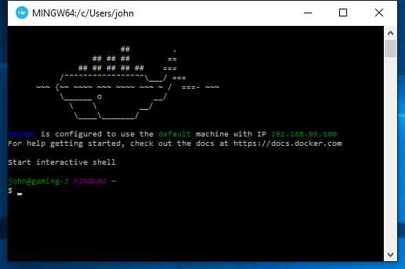
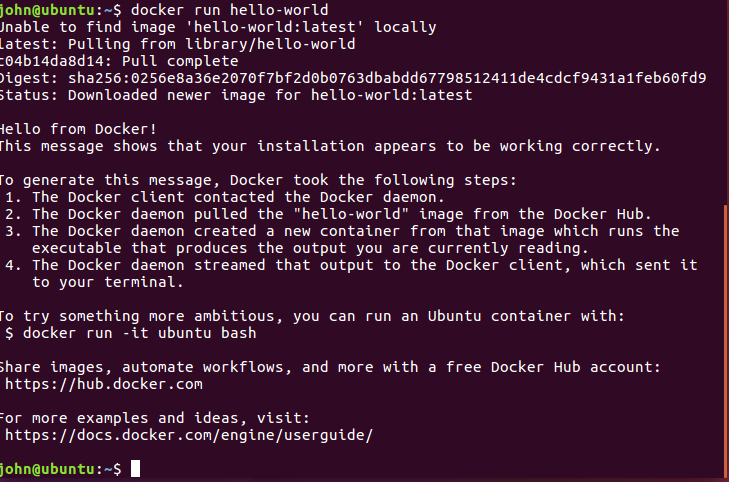
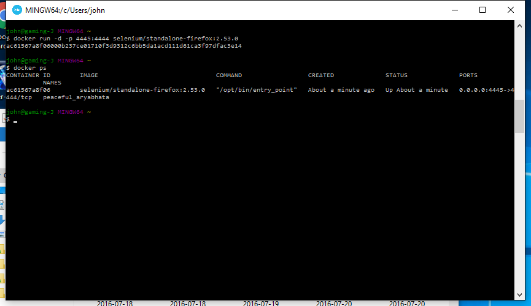
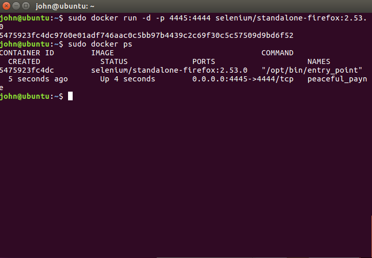

<!--
%\VignetteEngine{knitr::rmarkdown}
%\VignetteIndexEntry{RSelenium basics}
-->


## Introduction

The goal of this document to illustrate the use of docker and the Selenium project. The selenium project has released a number of containers to run various tools in the suite. 

### Why docker?

Running a docker container standardises the build across OS's and removes many of the issues
user may have relating to JAVA/browser version/selenium version etc.

## Preparing docker on Windows

The following outlines preparing a windows 10 home installation to run docker containers.

### Installing docker

Depending on your version of windows there are currently two ways of running docker.
Details are given at [Docker](https://docs.docker.com/engine/installation/windows/). For the version of windows Being used in this vignette (win 10 home) the older [Docker toolbox](https://www.docker.com/products/docker-toolbox) is what we are going to use to run containers.

Download the `.exe` for Docker toolbox and begin the install. Follow the instructions on the [toolbox install windows](https://docs.docker.com/toolbox/toolbox_install_windows/) page.

Clicking on the Docker Quickstart terminal link should eventually give you a terminal that resembles the following:



## Preparing docker on Linux

The following outlines preparing a ubuntu 16.04 installation to run docker containers.

### Installing docker

For a general guide for various Linux distros see [Docker](https://docs.docker.com/engine/installation/linux/)

#### Ubuntu 16.04

Run system update firstly

```
$ sudo apt-get update

```

Add the official Docker GPG key  to your system

```
$ sudo apt-key adv --keyserver hkp://p80.pool.sks-keyservers.net:80 --recv-keys 58118E89F3A912897C070ADBF76221572C52609D
```


Add the Docker repository to APT sources:

```
$ echo "deb https://apt.dockerproject.org/repo ubuntu-xenial main" | sudo tee /etc/apt/sources.list.d/docker.list

```

Update the package database:

```
sudo apt-get update
```

Now you should be able to install Docker

```
sudo apt-get install -y docker-engine
```

Start the docker daemon.

```
$ sudo service docker start
```

You can check that the Docker is working by running a test container:

For now run as `sudo`

```
$ sudo docker run hello-world
```




#### Running without sudo

If you want to run `docker` without `sudo` you can create a docker group and add the appropriate 
user to that group see [Docker](https://docs.docker.com/engine/installation/linux/ubuntulinux/#create-a-docker-group).


## Using Selenium  Docker images

The official docker repository can be viewed [here](https://hub.docker.com/u/selenium/) at Docker Hub. 


### Whats in an image?

Lets examine the [`selenium/node-firefox`](https://hub.docker.com/r/selenium/node-firefox/) image. The first thing to note is the `Tags`. 


Clicking this gives us the various tagged versions of this image. Clicking Dockerfile allows us
to view the source behind the image:


```
FROM selenium/node-base:2.53.0 
MAINTAINER Selenium <selenium-developers@googlegroups.com> 

USER root #========= 
# Firefox 
#========= 
ENV FIREFOX_VERSION 45.0.2 
```

we can see that this image will run selenium server and contain firefox version 45.0.2. 

We will be interested not in the node-firefox image but the [selenium/standalone-firefox](https://hub.docker.com/r/selenium/standalone-firefox/) image. Looking at its Dockerfile we see however that it is built on the first image we looked at.

### Pulling an image

#### Windows 10 - Docker toolbox


To get the image we are interested in we first click our quickstart link to open a terminal. 
We then issue the following command:

```
$docker pull selenium/standalone-firefox:2.53.0
```

Notice we appended a tag version so we are asking for the `2.53.0` version of this image.


#### Ubuntu 16.04 

Similar to windows we use the `docker pull` command. If you did not create and add your user to a `Docker` group you will need to `sudo`

```
$ sudo docker pull selenium/standalone-firefox:2.53.0
```

### Start your servers!

When we run an image we refer to that instance of the running image as a container. Importantly for Selenium we are dealing with a server so we require a port. We will have a port on the container and a port on the host machine (the machine that is running the container). The only
complexity will involve mapping the host port and container port. 

By default the Selenium images expose port 4444 and use this port for serving. This is not a problem for us and we can map as we see fit on the host machine.

#### Windows 10 running an image

Again we run docker and this time use the [`run`](https://docs.docker.com/engine/reference/commandline/run/) command. 

```
$ docker run -d -p 4445:4444 selenium/standalone-firefox:2.53.0
```

For illustration here we are mapping the container port 4444 to the host port 4445 so when we want to refer to our server on the host machine we will use 4445 as the port. 

We also run the [`ps`](https://docs.docker.com/engine/reference/commandline/ps/) command after running to show our current running containers.



So we can see an instance of standalone-firefox:2.53.0 is running. It has `id=ac61567a8f06` and is named `peaceful_aryabhata`.


#### Ubuntu 16.04 running an image

For ubuntu we also issue a `run` command followed by a listing of running containers with `ps`.
Again run as `sudo` if necessary:

```
$ sudo docker run -d -p 4445:4444 selenium/standalone-firefox:2.53.0
$ sudo docker ps
```



The `Ubuntu` container has `id=5475923fc4dc` and is named `peaceful_payne`.

A tip if you dont want to strain your eyes is to use the `--format` argument:

```
john@ubuntu:~$ sudo docker ps --format 'table {{.Names}}\t{{.Image}}\t{{.ID}}'
NAMES               IMAGE                                CONTAINER ID
peaceful_payne      selenium/standalone-firefox:2.53.0   5475923fc4dc
```

### Rselenium and running containers

Now that we have a container running a selenium server and its own firefox we can call it using `RSelenium`

#### Utilising the firefox standalone container in Windows 10

#### Utilising the firefox standalone container in Ubuntu 16.04

