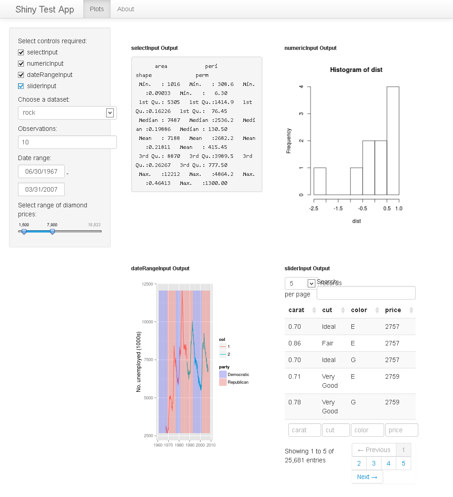

<!--
%\VignetteEngine{knitr::knitr}
%\VignetteIndexEntry{Shiny Testing}
-->

```{r, echo = FALSE, message = FALSE}
library(knitr)
library(RSelenium)
opts_chunk$set(comment = "#>", error = TRUE, tidy = FALSE)
```

# RSelenium: Testing Shiny Apps

## Introduction

The goal of this vignette is to give a basic overview of how one might approach "testing" a shiny app. [Shiny](http://www.rstudio.com/shiny/) is a new package from [RStudio](http://www.rstudio.com/) that makes it dramatically easier to build interactive web applications with R. Shiny Uses a reactive programming model and has built-in widgets derived from the [Bootstrap](http://getbootstrap.com/javascript/) front-end framework. In this vignette we will looking at writing unit tests for a simple shiny wep app. The testing package we will use is [testthat](https://github.com/hadley/testthat) which has a short introduction [here](http://journal.r-project.org/archive/2011-1/RJournal_2011-1_Wickham.pdf).


This vignette is divided into five main sections:

* [Some thoughts on testing.](#id1)
* [The shiny test app.](#id2)
* [Basic tests.](#id3)
* [section 4](#id4)
* [section 5](#id5)

Each section will be an introduction to an idea in testing shiny apps with Selenium, and point to more detailed explanation in other vignettes.

## <a id="id1">Some thoughts on testing.</a>

### Why test?
When faced with testing for the first time the natural reaction is to think what now? what do i test? how much/many tests do I write? 
Tests need to do something useful to survive. Automated tests should help the team to make the next move by providing justified confidence a bug has been fixed, confirming refactored code still works as intended, or demonstrating that new features have been successfully implemented. There should be sufficient tests – neither more nor less: more increase the support burden, fewer leave us open to unpleasant surprises in production.

One way to create our tests is to take the view of the user. What does the user want to do?
They want to see this particular graph of a given data set. How do they do that? They select various options and input various choices. From this list of actions we can create an outline 
of our code for the test. 

For each method, we need to work out how to implement it in code. How could an automated test select the sliderInput bar? Do alternative ways exist? An understanding of HTML, CSS, and JavaScript will help you if you plan to use browser automation tools. All the visible elements of a web application are reflected in the Document Object Model (DOM) in HTML, and they can be addressed in various ways. Some simple examples of interacting with the DOM using `RSelenium` are given in the `Rselenium-basic` vignette.

### Vary the tests.

Having static tests can lead to problems. Introducing variance into the tests can help pick up unexpected errors. This can be achieved by introducing an element of randomness into automatic inputs or randomizing order of selection etc.

### Vary the browsers/OS.

It can help to test against a variety of browsers and operating systems. `RSelenium` can interact with services like [sauceLabs](http://saucelabs.com/). `sauceLabs` allows one to choose the browser or operating system or the version of the selenium server to use. You can test with iOS/Android/Windows/Mac/Linux and browsers like firefox/chrome/ie/opera/safari. This can be very useful to test how your app works on a range of platforms. More detailed information and examples can be seen on the sauceLabs vignette.

### Record the tests.

RSelenium has the ability to take screenshots of the browser at a particular point in time. 
On failure of a test a screenshot can be useful to understand what happened. If you interface
RSelenium with `sauceLabs` you get screenshots and videos automatically. See the sauceLabs vignette for further details.

### Test for fixes.

Lots of bugs are discovered by means other than automated testing – they might be reported by users, for example. Once these bugs are fixed, the fixes must be tested. The tests must establish whether the problem has been fixed and, where practical, show that the root cause has been addressed. Since we want to make sure the bug doesn’t resurface unnoticed in future releases, having automated tests for the bug seems sensible.

## <a id="id2">The shiny test app.</a>

### Introduction
The shiny test app is composed of various widgets from the shiny package (0.8.0.99 at time of writing). We have also included the `ggplot2` library as output for one of the charts. The app includes examples of some of the controls included with the `shiny` package namely `selectInput`, `numericInput`, `dateRangeInput` and a `sliderInput`. These controls are used to produce output rendered using `renderPrint`, `renderPlot(base)`  , `renderPlot(ggplot2)` and `renderDataTable`.
The app can be viewed if you have `shiny` installed. 
```
require(shiny)
runApp(paste0(find.package("RSelenium"), "/apps/shinytestapp"))

```

Alternatively there is a version of the app running on the `RStudio` test server `spark` at 
[`http://spark.rstudio.com/johnharrison/shinytestapp/`](http://spark.rstudio.com/johnharrison/shinytestapp/).

An image of the app using `RSelenium` on a windows 8.1 machine running firefox 26.0

<h6 align = center>shinytestapp on win 8.1 firefox 26.0</h6>


The image was generated using `RSelenium` and the following code.

```
user <- "rselenium0"
pass <- "***************************"
port <- 80
ip <- paste0(user, ':', pass, "@ondemand.saucelabs.com")
browser <- "firefox"
version <- "26"
platform <- "Windows 8.1"
extraCapabilities <- list(name = "shinytestapp screenshot", username = user, accessKey = pass)

remDr <- remoteDriver$new(remoteServerAddr = ip, port = port, browserName = browser
                          , version = version, platform = platform
                          , extraCapabilities = extraCapabilities)
remDr$open()
remDr$navigate("http://spark.rstudio.com/johnharrison/shinytestapp/")
webElems <- remDr$findElements("css selector", "#ctrlSelect input")
lapply(webElems, function(x){x$clickElement()})
scr <- remDr$screenshot(display = TRUE)
```
### Observations

From the screenshot we retrieved from the remote Driver there are some interesting observations to make. On a local machine with high resolution (Nothing amazing just a laptop) we did not observe the `selectInput` and `numericInput` boxes. The 

We could have run with a higher resolution by passing the additional `screen-resolution` parameter to `sauceLabs`. 

```
extraCapabilities <- list(name = "shinytestapp screenshot", username = user
                          , accessKey = pass, "screen-resolution" = "1280x1024")

```
<h6 align = center>shinytestapp on win 8.1 firefox 26.0 res 1280x1024</h6>


We can see things look a bit better but the `data-table` search box is a bit compacted.

### Inputs and Outputs

The app is designed to show testing of the basic shiny components. It is a bit contrived so testing it may not be as natural as testing a live working app. The outputs (charts and tables) are designed to sit side by side if possible with a maximum of 2 on a "row" then drop down to the next "row". We can test to see if this is happening by checking the posistionof elements. We will investigate this later. 

## <a id="id3">Basic tests.</a>

### Basic Functionality

Can we connect to the app?<br>
Do all the inputs function?<br>
Do the outputs display?<br>
Do the tabs work?<br>


## <a id="id4">section 4</a>

## <a id="id5">section 5</a>


